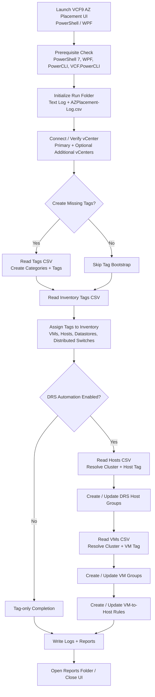

# VCF9 AZ Placement Automation UI

Single-page operational README for `VCF9-AZPlacement-Automation-UI-v1.0.9.ps1.txt`.

## Purpose

`VCF9 AZ Placement Automation UI` is a PowerShell 7 / WPF utility that connects to one or more vCenters and automates Availability Zone placement tasks using VMware PowerCLI and vSphere APIs.

The script can:

- Verify PowerShell/WPF and VMware module prerequisites.
- Connect to a primary vCenter and optional additional vCenters.
- Optionally create missing tag categories and tags from a tag bootstrap CSV.
- Assign inventory tags to VMs, hosts, datastores, and distributed switches from CSV input.
- Optionally create or update DRS host groups, VM groups, and VM-to-host affinity rules.
- Write execution logs and CSV audit output to a run-specific reports folder.

## Current Version

- Script version: `1.0.9-ui`
- README generated: `2026-05-04 01:09:04`

## Prerequisites

- PowerShell 7 or later.
- Windows desktop session capable of running WPF.
- VMware PowerCLI / VMware.VimAutomation.Core.
- Optional VCF.PowerCLI.
- vCenter account with permissions to read inventory, manage tags, and create/update DRS groups and rules.

The UI includes buttons to recheck prerequisites and install VMware modules for the current user.

## Input Files

### Inventory Tags CSV

Required for tag assignment. Rows identify inventory objects and one or more tags to assign.

Common columns supported by the script include:

- `EntityType`, `ObjectType`, or `Type`
- `EntityName`, `ObjectName`, `Name`, `VMName`, `HostName`, `DatastoreName`, `VDSwitchName`, or `DistributedSwitchName`
- `Tag1`, `Tag2`, etc.
- Optional matching `TagCategory1`, `TagCategory2`, etc.
- Optional `vCenter`, `Server`, or `VIServer`

### Hosts CSV

Required when DRS automation mode is enabled.

Typical columns:

- `ClusterName` or `Cluster`
- `HostRuleName`
- `TagName`
- Optional `TagCategory`
- Optional `vCenter`, `Server`, `VIServer`, or `ClusterVCenter`

### VMs CSV

Required when DRS automation mode is enabled.

Typical columns:

- `ClusterName` or `Cluster`
- `VMRuleName`
- `HostGroupName`
- `TagName`
- Optional `TagCategory`
- Optional `RuleName`
- Optional `RuleType`, default is `ShouldRunOn`
- Optional `Enabled`
- Optional `vCenter`, `Server`, `VIServer`, or `ClusterVCenter`

### Tags CSV

Optional. Used only when **Create missing tag categories and tags before execution** is selected.

Typical columns:

- `Category`, `CategoryName`, or `TagCategory`
- `TagName`, `Tag`, or `Name`
- `ObjectTypes`, `EntityTypes`, `EntityType`, or `AppliesTo`
- Optional `vCenter`, `Server`, or `VIServer`

## Execution Flow

1. Launch the script in STA mode when required.
2. Initialize a timestamped run folder and log files.
3. Render the WPF UI.
4. Recheck prerequisites.
5. Connect to one or more vCenters with PowerCLI.
6. Optionally bootstrap tag categories and tags.
7. Assign inventory tags from the Inventory Tags CSV.
8. If DRS automation is enabled:
   - Read Hosts CSV.
   - Build or update DRS host groups from tagged hosts.
   - Read VMs CSV.
   - Build or update VM groups from tagged VMs.
   - Create or update VM-to-host affinity rules.
9. Write text log and `AZPlacement-Log.csv` audit output.

## Architecture Diagram

The repository includes:

- `VCF9-AZPlacement-Architecture.mmd` — Mermaid source.
- `VCF9-AZPlacement-Architecture.png` — PNG rendering of the Mermaid-style flow.

## Outputs

Each run creates a timestamped folder under the selected reports path. Outputs include:

- PowerShell text log.
- `AZPlacement-Log.csv` audit log.
- Any generated operational output from the run.

## Operating Notes

- Passwords are intentionally excluded from saved UI configuration files.
- Use `vCenter`, `Server`, or `VIServer` columns when duplicate object or cluster names exist across connected vCenters.
- In tag-only mode, only the Inventory Tags CSV is required.
- In DRS mode, Inventory Tags CSV, Hosts CSV, and VMs CSV are required.
